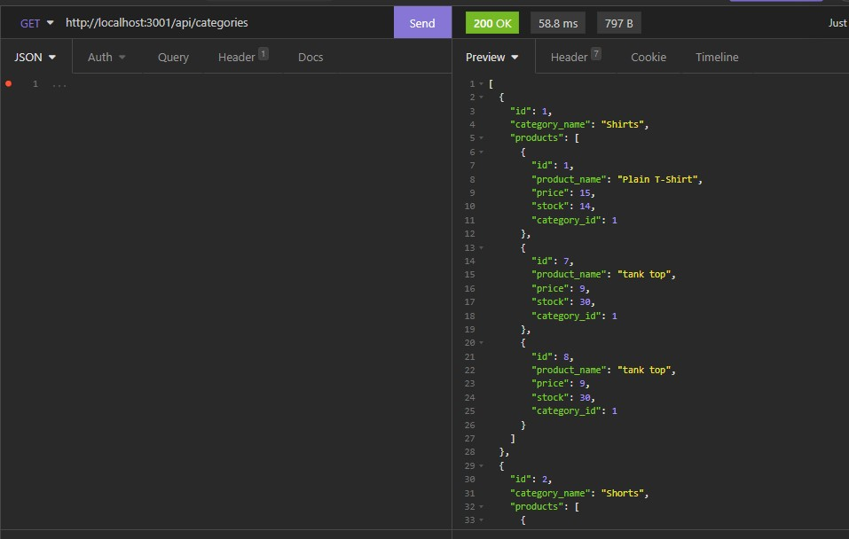
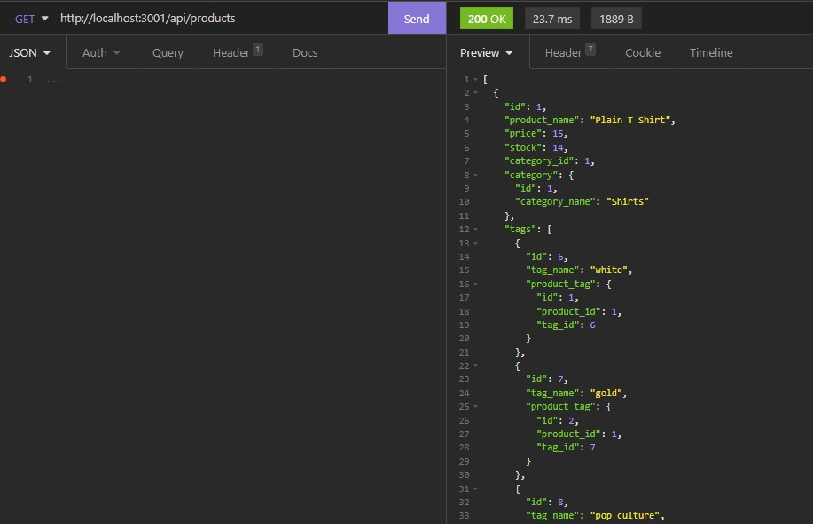
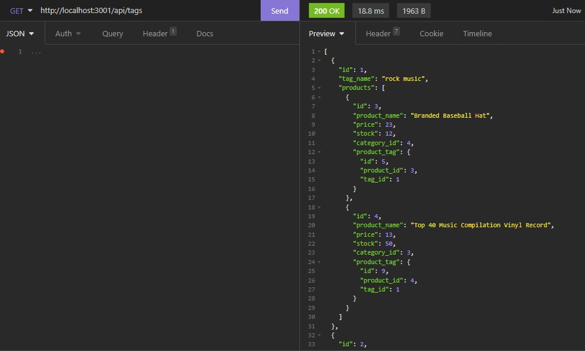

# E-commerce Back End

## Description

This is the backend functionality of an e-commerce website.  I was provided with most of the code and added to or updated the models, routes, and server to run the database with provided seed data.  

The video clips included demonstrate the functionality of the database routes.  

Note: One video displays an error in Insomnia when I test the product post route.  However, I checked the database and the product entered shows up in the desired table.  

## Built with 

-  Javascript
-  Node.js
-  MySql
-  Sequelize
-  Exress.js

Also used notenv for security and Insomnia and MySql workbench for testing. 

## Demo

View a demo of this application at these links:

-  https://drive.google.com/file/d/1k2M-kZJia5Tn-b1gMpFk6EucU2m5YPeb/view?usp=sharing
-  https://drive.google.com/file/d/1puiPhbziW8gxbSIrmM7kOWnFyZz-KtNz/view?usp=sharing

Screenshots showing the GET routes working successfully:

## Usage

In order to use this application the user must download all the included files, install all the required modules, and create their own .env file with their own login information.  

## Credits
-  Starter code provided by Xander Rapstine (Xandromus) and dependabot.
-  Updates made by Angela Gustafson (angiebunk1)